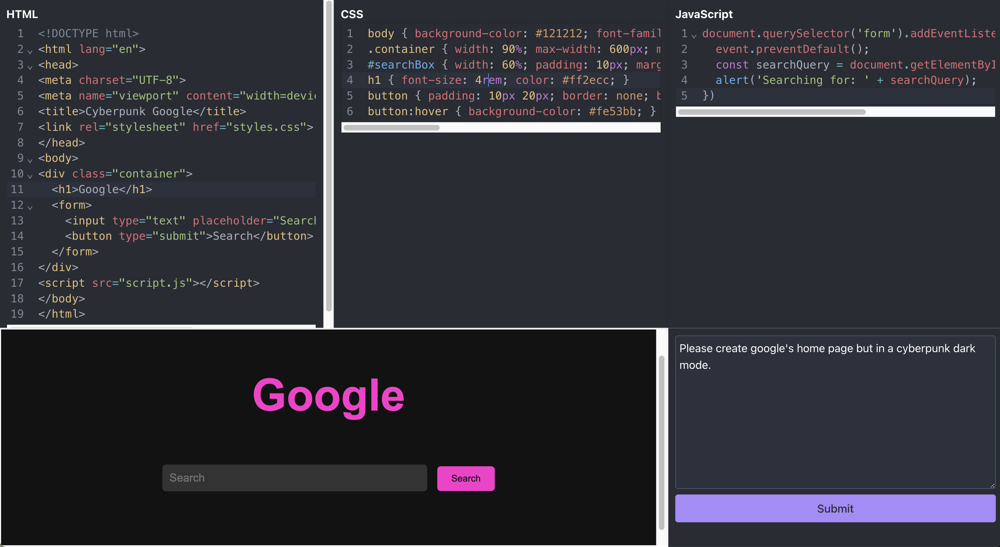

# WyzeBot

## Introduction
WyzeBot revolutionizes the way developers write code. With its cutting-edge AI capabilities, WyzeBot transforms natural language requests into ready-to-use code across HTML, CSS, and JavaScript. Designed to streamline the development process, it features a dynamic code editor and live preview window that updates instantly with every edit. WyzeBot is ideal for beginners and seasoned developers alike, simplifying code generation and enhancing productivity.

## Contact

**Aman Singh**

- Email: [amsingh714@gmail.com](mailto:amsingh714@gmail.com)
- Portfolio: [amans.dev](https://amans.dev)
- Project Link: [WyzeBot](https://www.wyzebot.com)

## About This Project
WyzeBot is crafted to empower developers by automating the routine task of code writing. It leverages AI to understand natural language inputs and convert them directly into functional code, significantly reducing development time and allowing developers to focus on complex problem-solving.

## Features
- **AI-Powered Code Generation**: Input descriptions in plain English and get back fully functional code.
- **Live Code Editor**: Make adjustments to the generated code and see the changes reflected immediately in the live preview.
- **Real-Time Preview Window**: A built-in feature that displays the UI output of your code, helping you see the impact of your changes in real time.
- **Support for Multiple Languages**: Generates code for HTML, CSS, and JavaScript, covering a wide range of web development needs.
- **User-Friendly Interface**: A sleek, intuitive interface that makes coding more accessible to everyone, from novices to experts.

## Technologies
WyzeBot utilizes a robust stack of technologies to deliver a seamless and efficient coding experience:

- **MongoDB & Mongoose**: For managing database operations, allowing easy data storage and retrieval.
- **Next.js**: A React framework that enables server-side rendering and generating static websites.
- **Next-auth**: Simplifies building authentication systems.
- **OpenAI**: Integrates AI functionalities, powering the natural language to code conversion.
- **@react-three/fiber and @react-three/drei**: Utilized for 3D rendering in the React environment.
- **Framer-motion**: Provides animation capabilities to enhance UI/UX.
- **TailwindCSS**: Used for styling with utility-first CSS framework for rapid UI development.
- **@codemirror/lang-html and @codemirror/lang-css**: Embedded in the code editor for enhanced syntax highlighting and interactive editing for HTML and CSS.
- **@uiw/react-codemirror**: Provides a React component for the CodeMirror text editor, enhancing the development experience.